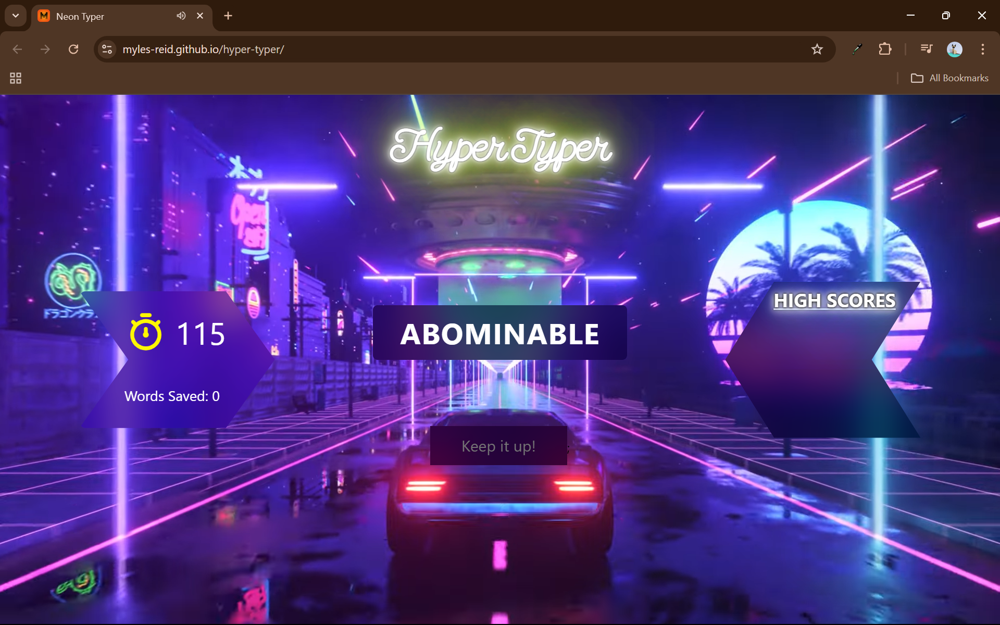
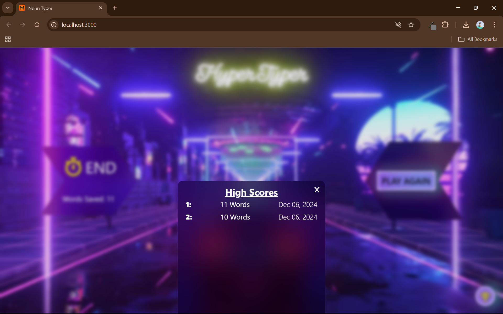
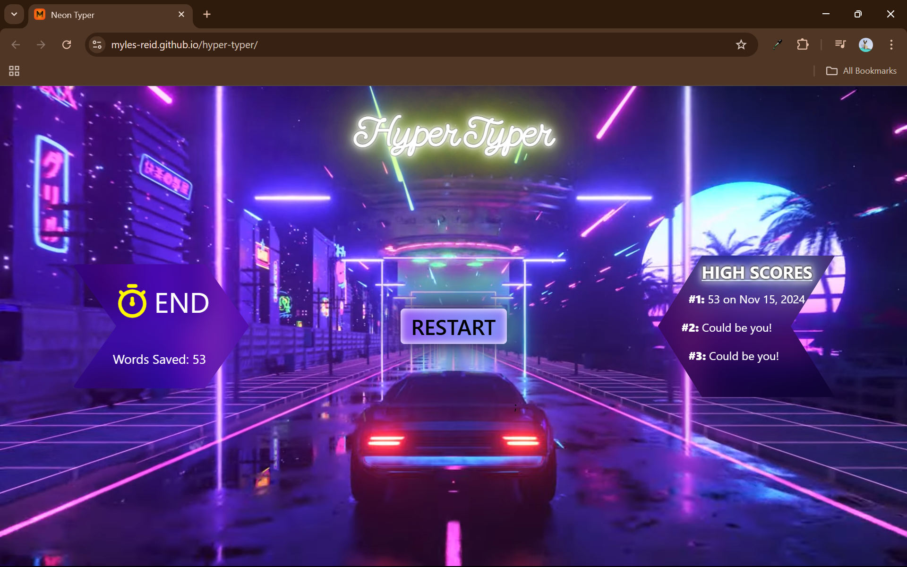

# Hyper Typer
Hyper Typer is a fast-paced typing game where players race against time to save
words from being abducted by aliens. Your goal? Type as many words as possible 
in two minutes to rack up a high score!

---

## Features

- Engaging neon design and visual effects.
- Intuitive gameplay mechanics suitable for all ages.
- A leaderboard to track high scores.

---

## Lessons Learned

This was a really great project to just put all of my previous knowledge to the test. Overall, it was not a complicated process, however figuring out how to have the imbedded youtube video as the background made for a little bit of a challenge. 

---

## Screenshots

---

  
  
   

